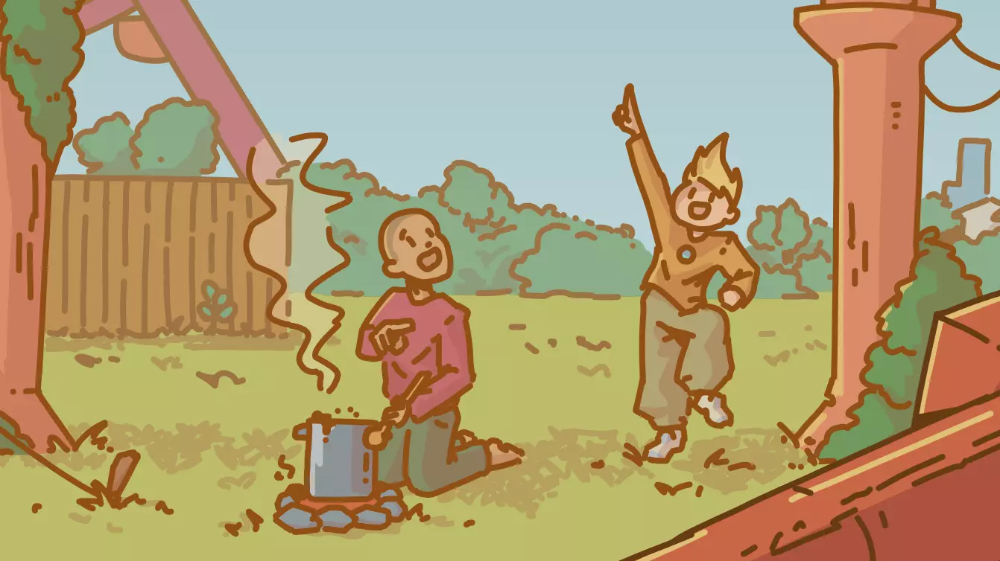

### Nathan Guilhot (aka NIGHTEͶ)

Hi there! I'm running things on the web since I was old enough to buy a domain name, and I've also programmed video game for a living (I published more than [+20 games](https://nighten.itch.io) publicly!)

I'm also a digital illustrator!

[Check out my resume](assets/CV%20Guilhot%20Nathan.pdf)

[Personal Website (since 2017)](https://nighten.fr)

[Pro Website (mostly about game programming for now)](https://nathan-guilhot.com)

Fediverse/Mastodon : [NIGHTEN@hi.nighten.fr](https://hi.nighten.fr/NIGHTEN)

[**EMAIL**](mailto:nathan.guilhot@gmx.fr)

<!--
**NightenDushi/NightenDushi** is a ✨ _special_ ✨ repository because its `README.md` (this file) appears on your GitHub profile.

Here are some ideas to get you started:

- 🔭 I’m currently working on ...
- 🌱 I’m currently learning ...
- 👯 I’m looking to collaborate on ...
- 🤔 I’m looking for help with ...
- 💬 Ask me about ...
- 📫 How to reach me: ...
- 😄 Pronouns: ...
- ⚡ Fun fact: ...
-->
